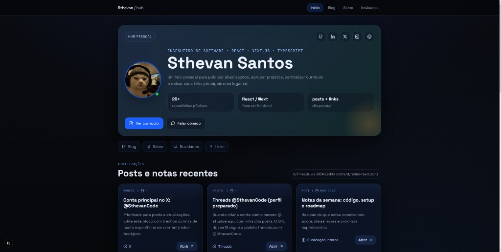

# Hub pessoal (mypage)



Site estático em [Next.js](https://nextjs.org/) (App Router): home com links, feed editorial, integração opcional com GitHub/YouTube, blog em Markdown, página Sobre e Novidades.

## Requisitos

- [Node.js](https://nodejs.org/) 18+
- [pnpm](https://pnpm.io/) (recomendado para instalar dependências)

## Instalação

```bash
pnpm install
```

## Scripts

| Comando | Descrição |
|--------|------------|
| `pnpm dev` | Servidor de desenvolvimento em [http://localhost:3000](http://localhost:3000) |
| `pnpm clean` | Remove a pasta `.next` (cache de build; use se aparecer erro ENOENT ou página sem CSS) |
| `pnpm dev:clean` | `clean` + `dev` em sequência |
| `pnpm build` | Build de produção |
| `pnpm start` | Sobe o build após `pnpm build` |
| `pnpm lint` | ESLint (Next.js) |

## Onde editar o conteúdo

| O quê | Onde |
|--------|------|
| Nome, bio, links, redes (LinkedIn, X, Threads), RSS do YouTube (futuro) | [`data/site.ts`](data/site.ts) |
| Os **3 repositórios** em destaque na home | Campo `github.featuredRepoNames` em [`data/site.ts`](data/site.ts) (nomes exatos como no GitHub) |
| “Últimos posts” de X / Threads na home | [`content/redes-feed.json`](content/redes-feed.json) — **manual** (sem API pública estável; edite título, link do post e data) |
| Texto da página Sobre, “O que me move”, timeline | [`data/sobre.ts`](data/sobre.ts) |
| Posts do blog | Arquivos `.md` em [`content/blog/`](content/blog/) com frontmatter (`title`, `date`, `excerpt`, `category`, `readingMinutes`) |
| Novidades / changelog curto | [`content/novidades.json`](content/novidades.json) |
| Foto de perfil | Coloque a imagem em `public/` (ex.: `public/foto-perfil.jpg`) e ajuste `avatar` em `data/site.ts` |

## Rotas principais

- `/` — Home (hero, feed, projetos GitHub, grade de links)
- `/blog` — Listagem de posts
- `/blog/[slug]` — Post (slug = nome do arquivo sem `.md`)
- `/sobre` — Sobre mim
- `/novidades` — Lista de novidades

## YouTube (opcional)

Com `youtubeRssUrl` vazio em `data/site.ts`, o feed usa só posts editoriais. Quando quiser vídeos automáticos, preencha com o RSS do canal; o código em [`lib/youtube.ts`](lib/youtube.ts) já está preparado.

## Erro `ENOENT` em `.next\\server\\vendor-chunks\\...` ou página sem estilo (fundo branco)

Isso costuma ser **cache do Next corrompido** (servidor fechado no meio do build, troca de branch, etc.).

1. Pare o `pnpm dev` (Ctrl+C no terminal).
2. Na raiz do projeto:

```bash
pnpm clean
pnpm dev
```

3. No navegador, faça um **hard refresh** (Ctrl+F5) em `http://localhost:3000`.

Se ainda falhar, rode `pnpm install` de novo e repita o passo 2.

## Problemas no editor (“Cannot find module”, muitos erros no Problems)

1. Rode `pnpm install` na raiz do repositório.
2. No VS Code / Cursor: **Ctrl+Shift+P** → **TypeScript: Select Workspace Version** (use a versão em `node_modules/typescript`).
3. Recarregue a janela se os avisos persistirem.

Arquivos como `LICENSE` podem ser marcados por extensões de ortografia ou Markdown; o projeto não depende deles para o build.

## Licença

Veja [LICENSE](LICENSE).
