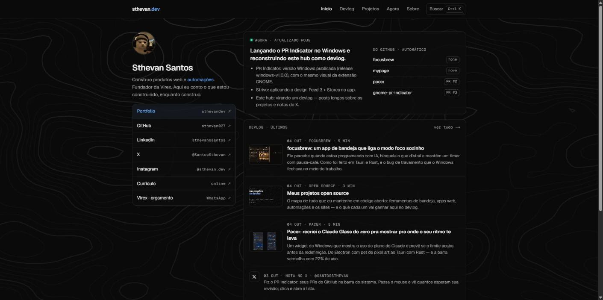
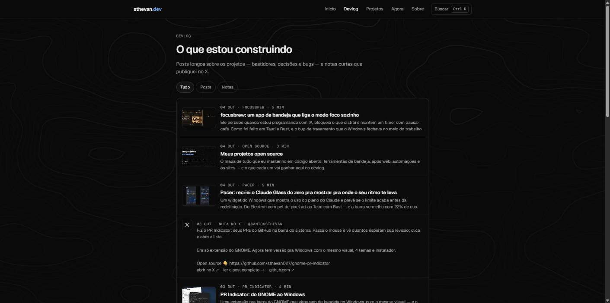
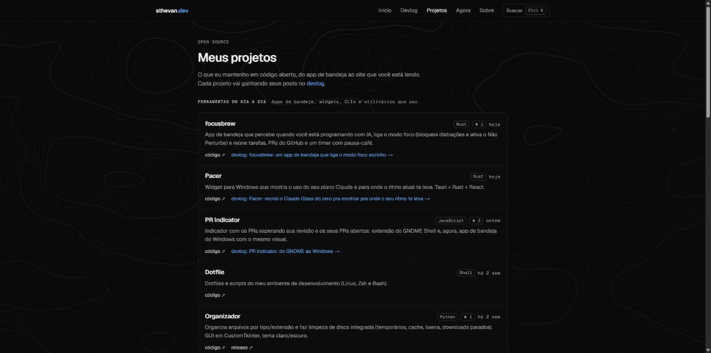
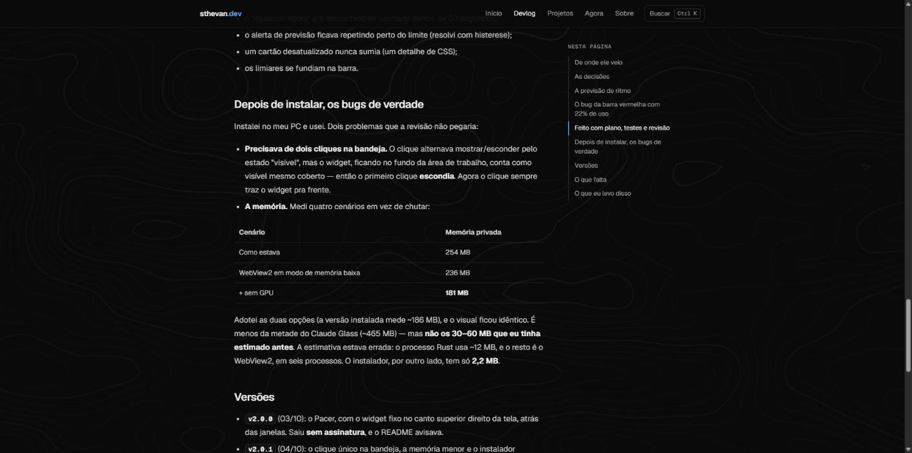
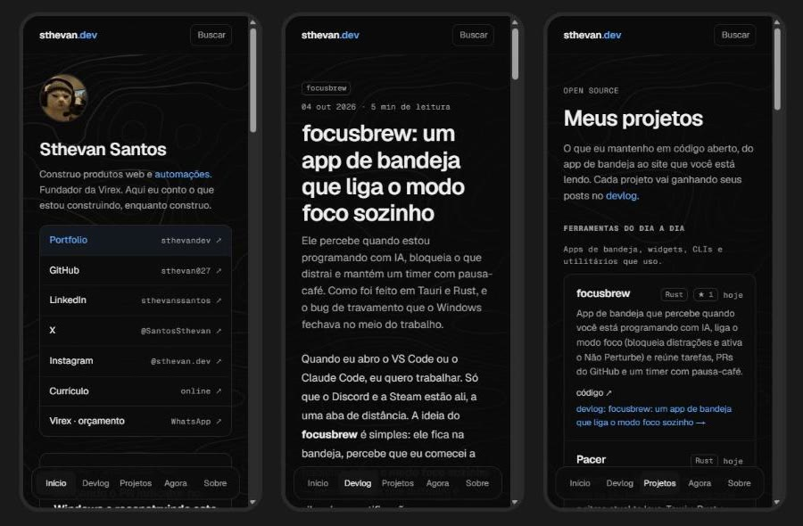

# Hub do Sthevan — devlog

   



**[sthevan-hub.vercel.app](https://sthevan-hub.vercel.app)** — o lugar do **processo**. O trabalho pronto fica no [Portfolio](https://sthevandev.vercel.app); aqui fica o que eu estou construindo, enquanto construo.

- **Início** — link-in-bio + bloco **"Agora"** (texto curto + atividade do GitHub, atualizada sozinha de hora em hora) + últimos itens do devlog.
- **Devlog** — **posts** longos em MDX (imagem, GIF, vídeo, código, destaques) com **índice lateral que marca a seção em que você está**, e **notas** puxadas dos meus posts no X. Filtro Tudo / Posts / Notas e RSS.
- **Projetos** (`/projetos`) — meus projetos **open source**, agrupados, com linguagem, estrelas e último push vindos do GitHub (cache de 1 h) e links pros posts do devlog de cada um.
- **Busca** — `Ctrl/⌘ + K` pula pra qualquer página, post ou link.
- **Visual minimal dev** (Geist, preto, azul `#60a5fa`) com **curvas de nível** geradas por código no fundo.
- **Fluido**: ~180 fps na rolagem (eram 46). Respeita `prefers-reduced-motion`.

## Telas

<table>
  <tr>
    <td width="50%"><a href="docs/screenshots/devlog.jpg"></a><br><sub><b>Devlog</b> — posts e notas do X misturados por data, com filtro.</sub></td>
    <td width="50%"><a href="docs/screenshots/projetos.jpg"></a><br><sub><b>Projetos</b> — open source, com dados do GitHub e links pros posts.</sub></td>
  </tr>
  <tr>
    <td colspan="2"><a href="docs/screenshots/post.jpg"></a><br><sub><b>Post</b> — texto, tabelas, imagens, código e o índice lateral acompanhando a leitura.</sub></td>
  </tr>
  <tr>
    <td colspan="2"><a href="docs/screenshots/mobile.jpg"></a><br><sub><b>Celular</b> — abas embaixo; perfil, "Agora" e links sem rolar.</sub></td>
  </tr>
</table>

## Rodar

```bash
pnpm install
pnpm dev        # http://localhost:3000
pnpm build      # build de produção
pnpm typecheck
pnpm lint
```

## Escrever um post

Crie `content/devlog/<slug>.mdx`:

```mdx
---
title: "Título do post"
date: "2026-10-03"
excerpt: "Uma ou duas frases que aparecem na lista."
project: "Nome do projeto"
cover: "/devlog/<slug>/capa.png"
draft: true
---

Texto em Markdown. Imagens e vídeos ficam em `public/devlog/<slug>/`.

<Figure src="/devlog/<slug>/print.png" alt="Descrição" caption="Legenda" />
<Figure src="/devlog/<slug>/demo.gif" alt="…" narrow />
<Video src="/devlog/<slug>/demo.mp4" caption="Legenda" />
<Callout>Um destaque no meio do texto.</Callout>
```

- Cada `## Seção` vira um item do índice lateral (que marca a seção atual).
- O campo `project` liga o post ao card do projeto em `/projetos` (veja `devlog` em [`data/projetos.ts`](data/projetos.ts)).
- **Rascunho:** com `draft: true`, o post aparece em `pnpm dev` e nos **previews** da Vercel, mas **não em produção**. Revisou? Troque pra `draft: false`.

## Adicionar uma nota do X

1. Cole o link do post em [`content/x-links.json`](content/x-links.json) (opcional: `"related": "<slug>"` liga a nota a um post longo).
2. Rode `pnpm sync:x` — busca o embed público do X (sem login, sem chave, sem custo), expande os links `t.co` e grava [`content/x-notes.json`](content/x-notes.json).
3. Commit. O site não chama o X quando alguém abre a página.

## Onde editar

| O quê | Onde |
|---|---|
| Nome, frase, links | [`data/site.ts`](data/site.ts) |
| Bloco "Agora" (texto) | [`data/agora.ts`](data/agora.ts) — atualize também `updatedAt` |
| Sobre | [`data/sobre.ts`](data/sobre.ts) |
| Projetos open source | [`data/projetos.ts`](data/projetos.ts) — **lista de permissão**: só aparece o que está lá (nada de cliente/trabalho entra sozinho) |
| Fundo de curvas de nível | [`scripts/gen-topo.mjs`](scripts/gen-topo.mjs) → `pnpm gen:topo` (troque a `SEED` pra outro desenho) |

O GitHub do "Agora" e de `/projetos` funciona sem token (limite de 60 req/h, com cache de 1 h). Pra subir o limite, defina `GITHUB_TOKEN` nas variáveis de ambiente da Vercel.

## Desempenho

A rolagem era de 46 fps: o fundo animava `background-position` (redesenho da tela inteira a cada quadro) e havia `backdrop-filter: blur` empilhado nos painéis e na barra fixa. Hoje o fundo é uma camada própria (`contain: strict`) que só usa `transform`, e os painéis são quase opacos. Medido rolando um post por script: ~180 fps, nenhum quadro acima de 20 ms.

## Estrutura

```
app/                 páginas (/, /devlog, /devlog/[slug], /projetos, /agora, /sobre, rss, sitemap)
components/          nav, paleta Ctrl+K, painel Agora, índice do post (toc), itens do devlog, componentes MDX
content/devlog/      posts (.mdx)
content/x-*.json     notas do X (links → notas sincronizadas)
data/                textos editáveis (perfil, Agora, sobre, projetos)
lib/                 devlog (posts/notas/rascunhos), github (atividade e repositórios), formatação
scripts/             gen-topo (fundo), sync-x-notes (notas do X)
public/devlog/       imagens, GIFs e vídeos de cada post
docs/                telas do README e spec/plano do hub v2 (docs/superpowers)
```

Rotas antigas redirecionam: `/blog` → `/devlog`, `/novidades` → `/agora`.
